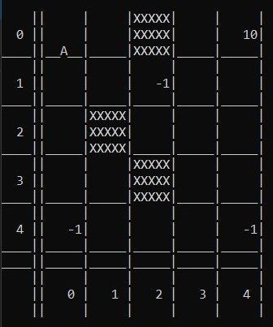
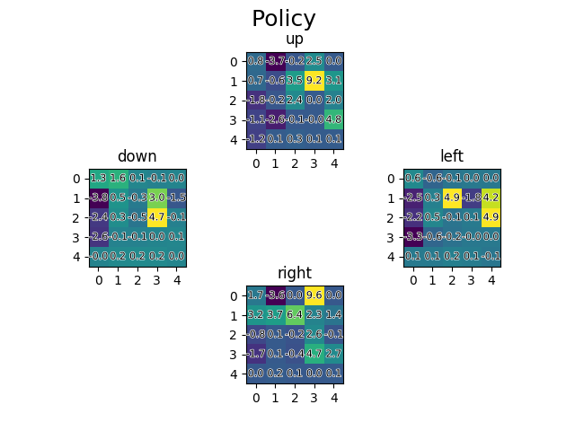
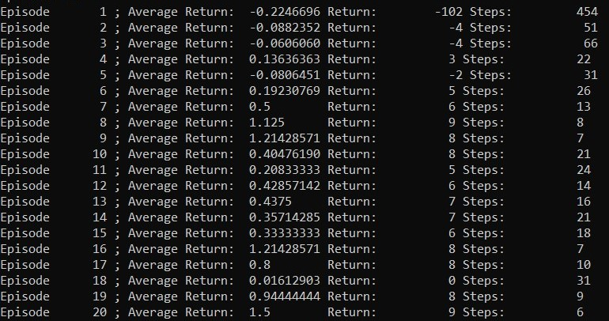
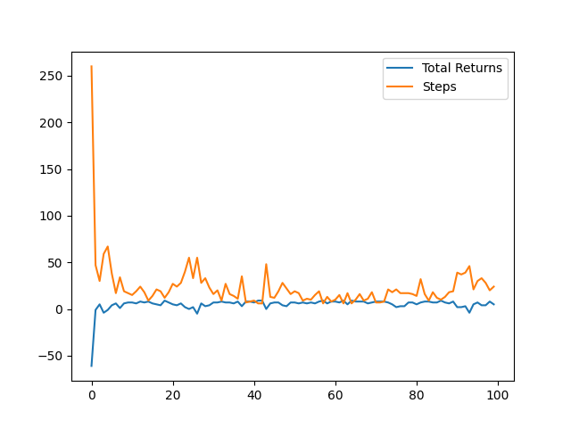

# SARSA-gridworld
This is an implementation of n-step SARSA and a gridworld to be solved by it. <br />
It was created for the course _Deep reinforcement learning_ <br />
Author: Eosandra Grund <br />
Date last modified: 20.07.2022 <br />
Sample execution code in [Main_SARSA.py](Main_SARSA.py), execute in shell. <br />

## The Gridworld

double lines are the end of the gridworld, behind that (first row and last line) are x and y values <br />
A = Agent <br />
X = barrier <br />
number = reward at the field <br />
<br clear="left"/>

The class Gridworld is implemented in the File [Grid.py](Grid.py). The constructor gets a dictionary with the layout.<br />
Structure of the dictionary: 
* x_dim (int>0) : x dimension of gridworld    
*  y_dim (int>0) : y dimension of gridworld   
* epsilon (0<float<1) : for epsilon-greedy state transition function   
* start [x,y] : starting state of agent for each episode   
* terminal [x,y] : terminal state with a positive reward   
* neg_rewards [[x,y,reward],[x,y,reward],...] : list of fields with negative rewards   
* barrier [[x,y],[x,y],...] : list of fields that are barriers   

There are some hardcoded gridworld dictionaries in the [Gridworlds.py](Gridworlds.py) file(access via class variable `Gridworlds.GRIDWORLD[index]`), but you can also create your own ones.  
A Gridworld has a starting state, a terminal state (with a positive reward of 10), some other negative rewards and barriers.
Possible actions are _up_, _down_, _left_ and _right_.
 
State transition function: In the environment you take the given action with the probabiliy 1-`epsilon` and a random action with probability `epsilon`. 

Reward function: 
* 10 for the terminal state
* other rewards as user inputs
* -0.5 for invalid moves (against barriers or outside of the gridworld)
* -0.1 for every move (if no other reward)

The gridworld will be visualized via stdout, and because old prints have to be removed so the gridworld stays in the same place, it is best to **execute everything in a shell**.

## The Agent
The agent is in the [SARSAn.py](SARSAn.py) file. It is an implementation of the reinforcement-learning algorithm [n-step SARSA](https://towardsdatascience.com/introduction-to-reinforcement-learning-rl-part-7-n-step-bootstrapping-6c3006a13265) and can also do 1-step SARSA and Monte Carlo.

It uses an epsilon-greedy policy with the possibility of decreasing the exploration over time (set `decreasing_epsilon = True`).

  

If you set `visualize_policy = True`, the q-values will be visualized after each episode as a matplotlib heatmap showing all state-action values.
<br clear="left"/><br />

Start the learning process with the start method. As parameters it gets the amount of _episodes_ you want to do and if you want an _evaluation_. <br />


list of the average return, total return and steps per episode
<br clear="left"/>


plot of the total return and steps per episode (The plot does only work if `visualize_policy = False`)
<br clear="left"/>

## How to execute
First you have to clone the repository.
You can use or modify Main_SARSA.py and execute it in the terminal.<br />
**Imports**:
```python
import matplotlib.pyplot as plt
import numpy as np
import SARSAn
import Grid
import Gridworlds
```
**Creation of the Gridworld**:
```python
which_gridworld = 0
world = Grid.Gridworld(Gridworlds.Gridworlds.GRIDWORLD[which_gridworld])
world.visualize()
```
Decide which default world by changing `which_gridworld` to any value between 0 and 4. The gridworld on the picture above is gridworld 0. <br />

**Creation of player and learning start**: 
``` python
player = SARSAn.SARSAn(
	gridworld=world, 
	n=10, epsilon=0.5, 
	decreasing_epsilon = True, 
	gamma = 0.99, 
	alpha = 0.3,
	visualize_policy = False, 
	visualize_grid = True)
player.start(episodes = 50, evaluation = True)
```
That means it is an 10-step SARSA solving Gridworld 0. You can change all of the parameters and see what happens. But changing them can cause the algorithm to be inefficient or not learning.<br />
Create an MonteCarlo approach by executing this instead of the last cell.
``` python
player = SARSAn.SARSAn(gridworld=world,n = np.inf, epsilon= 0.3,alpha = 1)
player.start(episodes = 50, evaluation = True)
```
You can export your pyplot plots by executing the following lines after the learning is done (Only the plots you will see during learning will be in the picture).
``` python
plt.savefig("Figure_SARSA_policy_returns.png")
```
